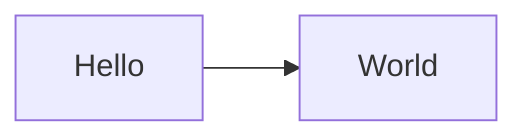

```json
{
  //You may skip this property or set it to null in order to use the first h1 level title from the document instead
  "title": "Custom Title",
  //A description that is a bit more detailed than the title, or acts as a subtitle
  "desc": "Example document that demonstrates a few features of this generator",
  //ISO 8601 date of publication, you can set this to "auto" to use the file modification timestamp instead, but be aware that accidental timestamp edits might reorder menu entries
  "date": "auto",
  //Information about the author. This entire block is optional, and will be copied from the global config file if absent
  "author": {
    //Display name of the author
    "name": "Your name here",
    //URL of the authors website, this is not necessarily the url of this blog.
    "url": "https://example.com/"
  },
  //Entry tags. This is currently unused
  "tags": ["test-1"]
}
```

# Example blog entry

This document serves as an example blog entry

## Code highlighting

To insert highlighted code sections, use the tripple backtick like so:

    ```c#
    public static class Program
    {
        public static void Main()
        {
            Console.WriteLine("Hello, World!");
        }
    }
    ```

Result:

```c#
public static class Program
{
    public static void Main()
    {
        Console.WriteLine("Hello, World!");
    }
}
```

The list of supported languages can be obtained from the highlight-js project

## Diagrams

For mermaid diagrams, simply use the "mermaid" language specifier for your code

    ```mermaid
    flowchart LR
        Hello --> World
    ```

Result:

