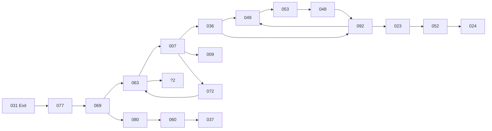

```json
{
  "title": "Custom title",
  "desc": "Description",
  "date": "2026-02-01T01:02:03+02:00",
  "author": {
    "name": "Custom author",
    "url": "https://example.com/"
  },
  "tags": ["test-1"]
}
```

# Test markdown document 1

1. List
2. List
3. List

## Code

Highlighted code

```bash
#!/bin/bash
echo 'Fenced Code' | grep Code
```

## Diagram

Random numbers pointing at each other


