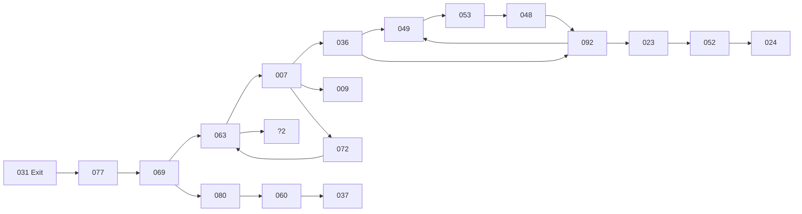

```json
{
  "title": "Custom title of document 2",
  "desc": "Description of document 2",
  "date": "auto",
  "tags": ["test-2"]
}
```

# Test markdown document 2

1. List
2. List
3. List

## Code

```bash
#!/bin/bash
echo 'Fenced Code' | grep Code
```

## Diagram


